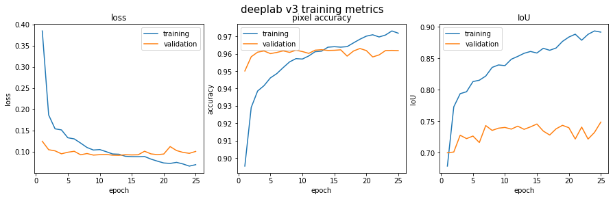
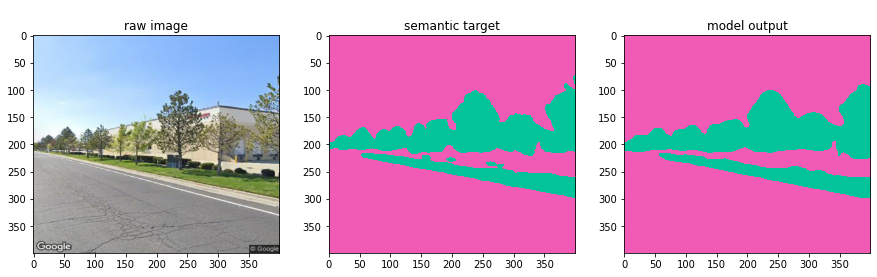

# deep-green-space

 

[Full project report](https://github.com/mkcyoung/deep-green-space/blob/main/Deep%20Learning%20Project%20Report.pdf)

## Quantifying green space with deep learning.

This project aims to quantify the amount of green space present in urban scenes using deep learning.  Green space is associated with increased health and well being of urban residents, improved urban landscape quality, and the promotion of sustainable lifestyles. Thus, it is useful for urban planners to be able to get an idea of the distribution of green space throughout a city.

## Green View Index
One way to quantify green space is by using the Green View Index (GVI) measure, which takes the number of pixels in an image belonging to greenery and divides that by the total number of pixels in the image. This essentially yields a green space percentage. The GVI for a given point in space can be estimated by considering the 360 degree view from that point either via a panorama or through a series of images which cover the whole space. 

## DeepLabV3
In order to differentiate between pixels belonging to "green space" and the rest, we use a popular semantic segmentation network -- [DeepLabV3](https://arxiv.org/abs/1706.05587) with a ResNet50 backbone. We implemented DeepLabV3 using [PyTorch](https://pytorch.org/docs/stable/torchvision/models.html#semantic-segmentation) and trained the network on the [Cityscapes](https://www.cityscapes-dataset.com/) dataset, adjusting the network to classify the 2 Cityscapes classes associated with green spaces: vegetation (trees, bushes, and various shrubbery), and terrain (grass).

After training our model on the Cityscapes data, we applied it to [Google Street View](https://developers.google.com/maps/documentation/streetview/overview) (GSV) images sampled from 9,000+ points around Salt Lake City, Utah. In order to eek out the best performance of our model on the SLC data, we hand labeled 150 training images from the GSV SLC and another 60 as a test set. We then took this model and used it to estimate the distribution of green space throughout SLC.

## Results

An example of our model predictions on the Cityscapes validation set.

The loss, pixelwise accuracy, and IoU of our model trained and evaluated on the hand-labeled SLC GSV images. 

We acheived a pixelwise accuracy of **96.1%** and an mIoU of **74.8%**. We computed the GVI for our predictions and compared them with the GVI for the ground truth labels and found that the mean difference was **1.42 +/- 1.45%**.   
    
A few examples of predictions from our model on the SLC test set:

  
 
    
A map depicting the average GVI for each census block in SLC:

## Acknowledgements 
This was the final project for the course CS 6955:Deep Learning, taught by Berton Earnshaw at the University of Utah. Jiuying Han and Andrew Campbell created this project with me, and Jiuying made the map showing the GVI for each census block in SLC.

